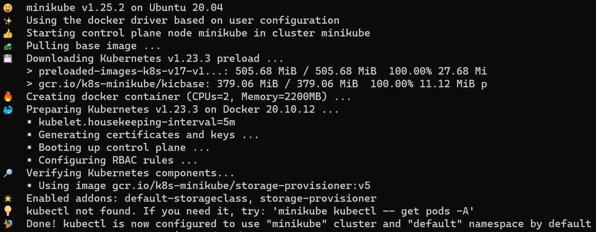
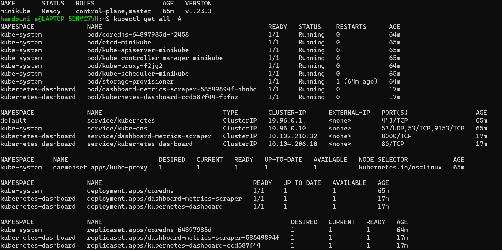
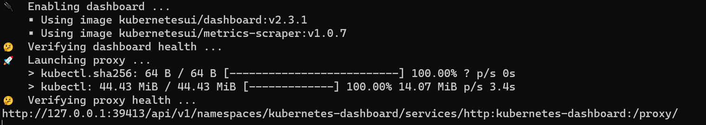

# Installation of Minikube from scrach in WSL2

## Install a WSL2 distribution
We will use Ubuntu-20.4 (focal) distribution in this documentation  
All subsequent commands will be run in a In **Windows** powershell or cmd.exe

### Install Ubuntu distribution - Option 1
```
wsl --install -d Ubuntu-20.04 --version 2
```

### Install Ubuntu distribution - Option 2
download https://cloud-images.ubuntu.com/focal/current/focal-server-cloudimg-amd64-wsl.rootfs.tar.gz  
Create a WSL\minikube directory somewhere. Then install it :
```
wsl --import minikube .\WSL\minikube .\Downloads\focal-server-cloudimg-amd64-wsl.rootfs.tar.gz --version 2
```

## Install Minikube

start wsl session with your previously installed ditribution. Let's suppose *Option 2*.
```
wsl -d minikube
```

Now we switch to **Linux** shell for next commands 

### (Optional) sudo without password
Update this line from file /etc/sudoers to add NOPASSWD parameter for users members of admin group:  
``
%admin ALL=(ALL) NOPASSWD:ALL
``

### (Optional) create user
Create a new regular user if you dont' have one
```
adduser <user>  
```

### add user to admin group
```
usermod -G admin -a <user>
``` 

### switch to user session
```
su - <user>
``` 

## Install docker
Some cleaning of previously installed docker packages might be needed:
```
sudo apt-get remove docker docker-engine docker.io containerd runc
```

### Install docker-ce packages:
```
sudo apt-get install ca-certificates curl gnupg lsb-release
sudo mkdir -p /etc/apt/keyrings
curl -fsSL https://download.docker.com/linux/ubuntu/gpg | sudo gpg --dearmor -o /etc/apt/keyrings/docker.gpg
echo "deb [arch=$(dpkg --print-architecture) signed-by=/etc/apt/keyrings/docker.gpg] https://download.docker.com/linux/ubuntu \
$(lsb_release -cs) stable" | sudo tee /etc/apt/sources.list.d/docker.list > /dev/null
sudo apt-get update
sudo apt-get install docker-ce docker-ce-cli containerd.io docker-compose-plugin
```

## Install minikube
```
curl -sLo minikube https://storage.googleapis.com/minikube/releases/latest/minikube-linux-amd64
chmod +x minikube
sudo mkdir -p /usr/local/bin/
sudo install minikube /usr/local/bin/
rm minikube
```

### Add user to docker group
```
usermod -G docker -a <user>
```

### Start docker daemon and minikube:
```
sudo service docker start
minikube start --driver=docker
```
you should get something like this


## Post-installation 
Add these lines to your *.profile* file and source it  
``alias kubectl='minikube kubectl --'``  
``alias k='kubectl'" >> .profile``

```
source .profile
```

check cluster status
```
kubectl get nodes
kubectl get all -A
```



start dashboard
```
minikube dashboard --url
```



copy past the url from previous command in your browser


---
# Enjoy!